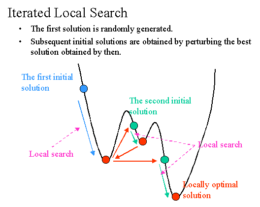
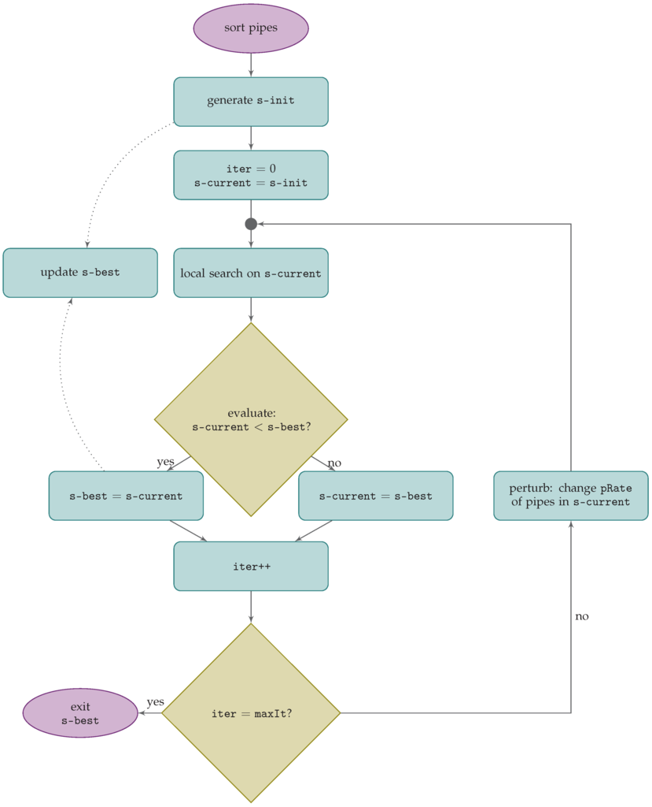

Iterated Local Search (also known as ILS) applies local search to an initial solution until it finds a local optimum; then it perturbs the solution and it restarts local search. The importance of the perturbation is obvious: too small a perturbation might not enable the system to escape from the basin of attraction of the local op- timum just found. On the other side, too strong a perturbation would make the algorithm similar to a random restart local search.

On the one hand, its generality makes it a framework for other metaheuristics (such as VNS); on the other hand, other metaheuristics can be easily incorporated as subcomponents. ILS is a simple but powerful metaheuristic algorithm.

Pseudocode
----------
function IterateLocalSearch(GeneralInitialSolution):
	s  = GeneralInitialSolution
	s* = LocalSearch(s, maxIterations)
	while(!terminationCondition):
		s'  = Pertubation(s*, n)
		s*' = LocalSearch(s', maxIterations)
		s*  = AcceptanceCriterion(s*, s*')
	end

(1) Execute local search (LS) from an initial state s until a local minimum s* is found.
(2) Perturb s* and obtain s'.
(3) Execute LS from s' until a local minimum s*' is reached.
(4) On the basis of an acceptance criterion decide whether to set s* <- s*'.
(5) Goto step 2.

The key idea underlying iterated local search is to focus the search not on the full space of all candidate solutions but on the solutions that are returned by some underlying algorithm, typically a local search heuristic. We can say that Iterated Local Search is a non nature-inspired algorithm.

**Fuentes**: 
`Metaheuristics in Combinatorial Optimization: Overview and Conceptual Comparison Christian Blum, Andrea Roli <https://informatica.cv.uma.es/mod/resource/view.php?id=389734>`_ 
`Handbook of Metaheuristics (pp.363-397) , M. Gendreau and J.Y. Potvin <https://www.researchgate.net/publication/265303019_Handbook_of_Metaheuristics>`_
