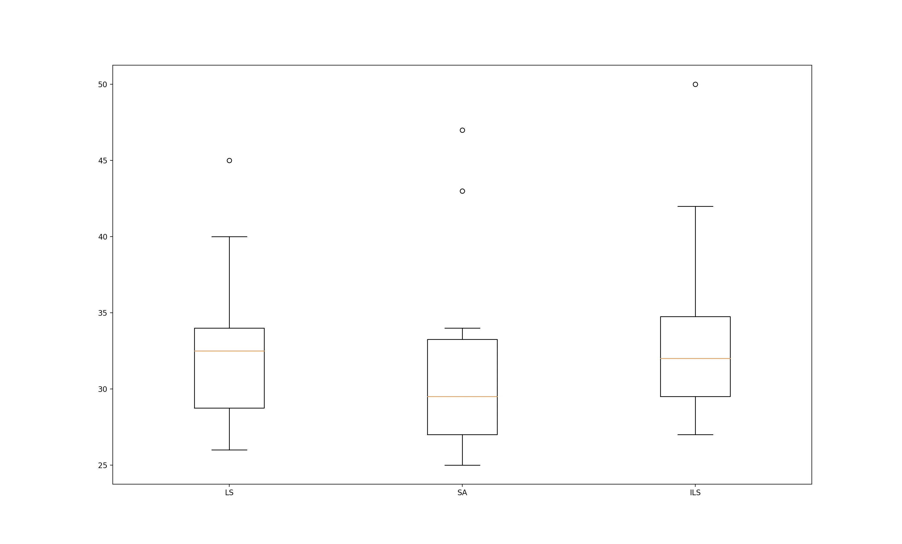

Performance evaluation
======================

To assess the performance of the implemented algorithms, we are going to conduct an experimentation process consisting in
performing ten independent runs per algorithm by using as the target problem the BB11001 instance which has been
previously aligned by using Clustal Omega (file `BB11001.tfa_clu`, located in the resources folder). To ensure that
the comparison is fair, all the algorithms are configured to stop when 1 million of evaluation have been computed.

+-----+------+------+------+------+
| Run |  LS  |  SA  |  ILS |  GLS |
+=====+======+======+======+======+
|  1  |  31  |  34  |  32  |  37  |
+-----+------+------+------+------+
|  2  |  34  |  29  |  34  |  39  |
+-----+------+------+------+------+
|  3  |  27  |  27  |  29  |  34  |
+-----+------+------+------+------+
|  4  |  34  |  30  |  29  |  29  |
+-----+------+------+------+------+
|  5  |  45  |  31  |  42  |  31  |
+-----+------+------+------+------+
|  6  |  28  |  43  |  50  |  30  |
+-----+------+------+------+------+
|  7  |  26  |  25  |  31  |  33  |
+-----+------+------+------+------+
|  8  |  40  |  26  |  27  |  31  |
+-----+------+------+------+------+
|  9  |  34  |  27  |  45  |  30  |
+-----+------+------+------+------+
| 10  |  31  |  47  |  32  |  31  |
+-----+------+------+------+------+

.. code-block:: python

    # Python script to analyze the results
    import scipy.stats as stats
    import matplotlib.pyplot as plt

    local_search_fitness = [31,34,27,34,45,28,26,40,34,31]
    simulated_annealing_fitness = [34,29,27,30,31,43,25,26,27,47]
    iterated_local_search_fitness = [32,34,29,29,42,50,31,27,35,32]

    plt.boxplot([local_search_fitness, simulated_annealing_fitness, iterated_local_search_fitness], labels=["LS", "SA", "ILS"])
    plt.show()

    # https://www.statology.org/mann-whitney-u-test-python/
    print(stats.mannwhitneyu(local_search_fitness, simulated_annealing_fitness))

