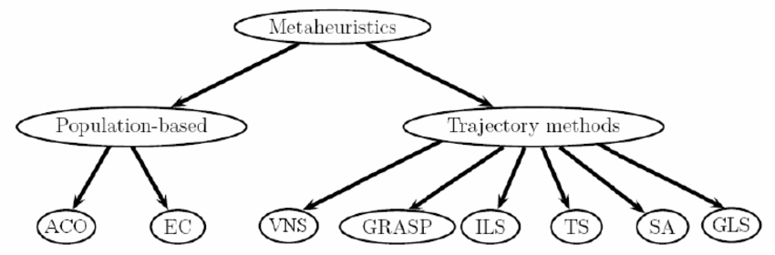

Trajectory-based metaheuristics
===============================

Metaheuristic optimization deals with optimization problems using metaheuristic algorithms.
Optimization is essentially everywhere, from engineering design to economics and from holiday planning to Internet routing.
As money, resources and time are always limited, the optimal utility of these available resources is crucially important.

To solve the optimization problem, efficient search or optimization algorithms are needed.
There are many optimization algorithms which can be classified in many ways, depending on the focus and characteristics.

From a different perspective, optimization algorithms can be classified into trajectory-based and population-based. The main difference of these two kind of methods relies in the number of tentative solutions used in each step of the (iterative) algorithm.
A trajectory-based technique starts with a single initial solution and, at each step of the search, the current solution is replaced by another (often the best) solution found in its neighborhood.
It is usual that trajectory-based metaheuristics allow to quickly find a locally optimal solution,
and so they are called exploitation-oriented methods promoting intensification in the search space.

A trajectory-based metaheuristic iteratively improves a single solution and forms a search trajectory in the solution space.
There are six types of Trajectory-based Metaheuristics methods:

(1) VNS: Variable neighborhood search
(2) GRASP: Greedy Randomized Adaptative Search Procedure
(3) ILS: Iterated Local Search
(4) TS: Tabu Search
(5) SA: Simulated Annealing
(7) GLS: Guided Local Search

**Sources**:
`Metaheuristic optimization, Xin-She Yang <http://www.scholarpedia.org/article/Metaheuristic_Optimization>`_